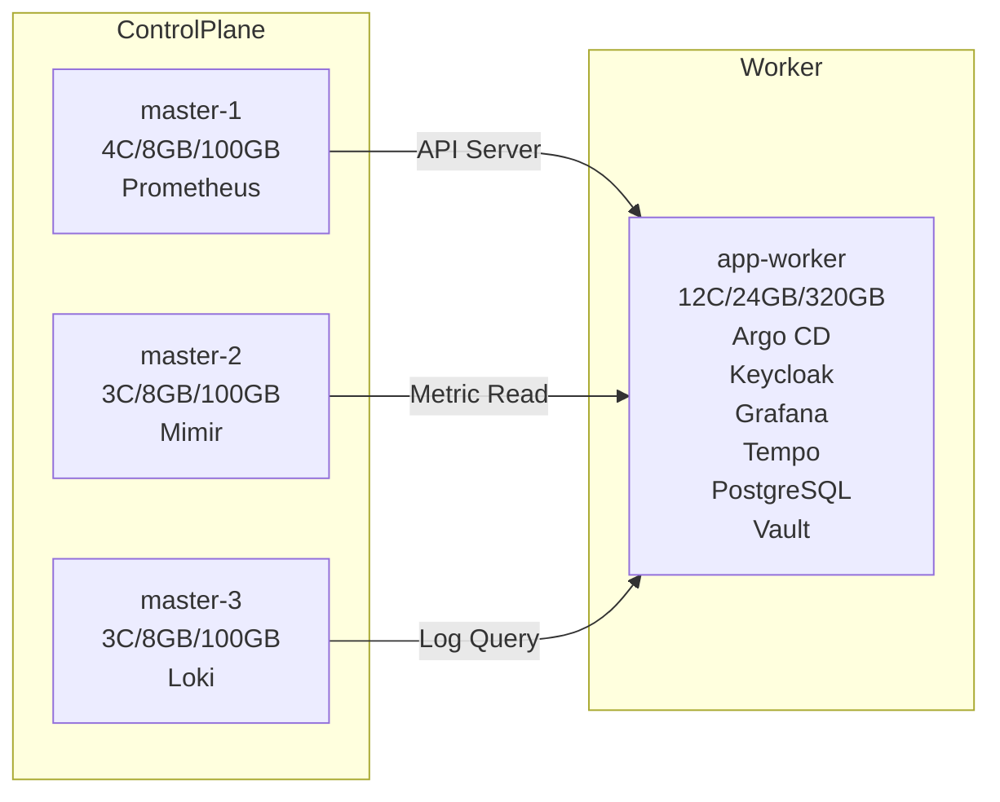

# detectviz-gitops

[](https://www.terraform.io/)
[](https://www.ansible.com/)
[](https://argo-cd.readthedocs.io/)


> [!INFO]
> 本專案設計以展示用途為主，重視服務分佈與觀測整合，不強調效能壓測或高負載支撐能力做過度設計。

Detectviz Infra 採用多層自動化堆疊實現完整基礎設施管理。底層使用 KVM 與 Proxmox 作為虛擬化平台，Terraform 負責 VM 的宣告式建立，Ansible 用於 VM 的設定與 Kubernetes 安裝。接著透過 Argo CD 實現 GitOps 控制面，並以 Helm 部署 Kubernetes 應用。整體流程如下：

```bash
KVM/Proxmox
    ↓
[P1]Terraform (VM 建立)
    ↓
[P2]Ansible (Kubernetes 安裝)
    ↓
[P3]Argo CD (GitOps 啟動)
    ↓
[P4]Helm (Infrastructure Namespace)
    ↓
[P5]Helm (Application Namespace)
```

此專案為 Detectviz 平台的基礎層，用於建構 Kubernetes 環境與 GitOps 控制面。



## infra 服務列表 (detectviz-gitops)
對應部署階段：[P2] ~ [P4]
- [P2] **kube-vip**：控制平面高可用 (VIP)
- [P2] **calico**：CNI 網路插件 (NetworkPolicy)
- [P3] **argocd**：GitOps 控制面與應用交付
- [P3] **vault**：秘密管理與安全存儲
- [P3] **cert-manager**：TLS 證書自動化管理
- [P3] **external-secrets-operator**：從 Vault 同步秘密至 Kubernetes Secret
- [P4] **metallb**：LoadBalancer 服務提供
- [P4] **topolvm**：本地儲存 Volume 管理
- [P4] **ingress-nginx**：提供外部入口的 L7 Proxy（使用 NGINX controller）

> [!NOTE]
> Kubernetes 預設系統元件（如：`coredns`, `kube-controller-manager`, `kube-scheduler`, `kube-proxy`）由 Ansible 安裝時一併建立，雖不經 Helm 管理，仍為 Control Plane 基礎組件。

## apps 服務列表
對應部署階段：[P5]
- [P5] **keycloak**：OIDC 身份與存取控制
- [P5] **grafana**：可觀測性與視覺化介面
- [P5] **tempo**：追蹤資料收集與分析
- [P5] **loki**：日誌收集與查詢後端（Grafana 整合）
- [P5] **postgresql**：資料庫服務 (Grafana / Keycloak / Vault backend)
- [P5] **prometheus-node-exporter**：節點層級 metrics 收集
- [P5] **alertmanager**：告警通知與規則管理
- [P5] **grafana-alloy**：統一收集 log、metrics、trace 的代理元件

## Grafana 預設整合
為強化展示一致性，Grafana 透過 Helm 的自動化設定預設載入以下元件：
- **Datasource Provisioning**：
  - Prometheus（metrics）
  - Loki（logs）
  - Tempo（traces）
  - Alertmanager（alerts）

- **Dashboard Provisioning**：
  - Node Exporter Overview
  - Kubernetes Control Plane
  - Loki Log Summary
  - Tempo Trace Map

## 目錄結構
```bash
detectviz-gitops/
├── bootstrap/                 # 集群級別引導資源
│   ├── argocd-projects.yaml   # ArgoCD AppProjects
│   ├── cluster-resources/     # Namespaces + 證書 + 擴展
│   └── README.md
├── apps/
│   ├── infrastructure/
│   │   ├── argocd/            # ArgoCD namespace-level 資源
│   │   └── ...
│   └── observability/
│       └── ...   
├── appsets/                       # ApplicationSets
│   ├── argocd-bootstrap-app.yaml  # ArgoCD + 集群資源引導
│   ├── infra-appset.yaml          # detectviz-apps/infra/
│   └── apps-appset.yaml  # detectviz-apps/apps/
├── root-argocd-app.yaml           # App-of-Apps
└── README.md
```

## 前置作業（手動初始化）

以下步驟僅需執行一次，作為 Detectviz 平台初始建置前的準備作業：

### 1. SSH Key 建立與發佈
- `ssh-key.pub`：供 Terraform 建立 VM 時注入
- 對應公鑰應發佈至 Cloud-Init 模板與 Proxmox VM User

### 2. Proxmox 基礎資訊定義
- `proxmox_host`: 192.168.0.X
- `api_token_id` / `api_token_secret`
- `node_name`: pve
- `template_name`: ubuntu-2204-template
- 設定方式可透過 `terraform.tfvars` 或 `proxmox.auto.tfvars` 管理

### 3. Proxmox Ubuntu Template 製作
- 需事先匯入 Ubuntu 22.04 Cloud Image（img/iso 皆可）
- 啟用 Cloud-Init 模式，設定：
  - Serial Console 開啟
  - Network Interface 使用 VirtIO + Bridge 指定 vmbr0
  - 安裝 `qemu-guest-agent`
  - 開機後自動啟用 `cloud-init`

### 4. Kubectl 與 Kubeconfig 憑證備妥
- 用於驗證控制平面是否正常初始化
- 可由 Ansible 安裝後的 `~/.kube/config` 匯出
- 建議 kubectl 備份至安全路徑並供後續 `argocd login` 使用

### 5. Secrets 管理建議
| 類型 | 來源 | 建議儲存方式 |
|------|------|--------------|
| Vault Root Token | 初始 `vault operator init` | 使用 Bitwarden / 1Password |
| Argo CD Admin 初始密碼 | `argocd-initial-admin-secret` | 記錄於 secrets/argocd.md |
| Terraform Variables | proxmox.tfvars / secrets.auto.tfvars | 僅儲存在本地 `.secrets` 資料夾並加 .gitignore |
| SSH Key | `~/.ssh/id_rsa` | 僅儲存於本機，用於 Ansible SSH |

> [!IMPORTANT]
> 上述設定屬於平台初始化基礎建置，需手動建立與驗證。請勿納入 Git 版本控管，建議集中記錄於 `/secrets/` 或 `/bootstrap/manual/` 區段並備有內部指引。

### 6. Cloudflare DNS API Key 建立（如使用 Cloudflare 為 DNS Provider）
- 可用於 cert-manager DNS-01 驗證自動化
- 建議產出 API Token 並限制於 zone:edit 權限
- 記錄於 secrets/cert-manager.md 中（勿納入 Git）

### 7. Argo CD 登入與 token 產製
- 完成 `argocd login` 後可產出 access token，供 GitOps 或 CI/CD 使用
- 建議儲存於 secrets/argocd-token.md 並加入 .gitignore

## 部署流程摘要
1. Terraform → 建立 VM，並輸出 IP 與資源配置
2. Terraform output → 提供初始化資訊給 Ansible
3. 執行中介腳本進行環境檢查與補強：
   > [!TIP]
   > 初始化補強腳本已收錄於 `scripts/` 目錄，包含：
   > - `scripts/health-check.sh`：節點通訊健康檢查
   > - `scripts/render-node-labels.sh`：根據 VM metadata 渲染節點標籤與 inventory
   > - `scripts/validation-check.sh`：驗證初始化一致性
   > - `scripts/enable-qemu-guest-agent.sh`：安裝與啟用 qemu-guest-agent
4. Ansible → 安裝 Kubernetes 並初始化控制平面與 CNI 網路
5. Argo CD → 啟動 GitOps  
6. Helm → 部署應用。  
（所有應用集中於 app-worker，簡化節點分佈並利於展示追蹤）

## [P1] Terraform VM 建立清單
Terraform 管理以下虛擬機資源建立，並透過 Cloud-Init 設定初始化資訊，供後續 Ansible 接手：
| VM | Hostname | IP | Role | Resources |
|----|----------|----|------|-----------|
| VM-1 | master-1 | 192.168.0.11 | Control Plane | 4C / 8GB / 100GB |
| VM-2 | master-2 | 192.168.0.12 | Control Plane | 3C / 8GB / 100GB |
| VM-3 | master-3 | 192.168.0.13 | Control Plane | 3C / 8GB / 100GB |
| VM-4 | app-worker | 192.168.0.14 | Application Node | 12C / 24GB / 320GB |

## 最佳化建議檢查清單 (持續更新中)
- [ ] Root Application 與 ApplicationSet 為 `Synced`/`Healthy`
- [ ] Root Application 使用 `platform-bootstrap` AppProject，避免讓具有廣泛權限的 default AppProject 對 bootstrap 與業務應用的存取控制。
- [ ] 使用 ApplicationSet 區分環境 overlay。  
- [ ] 命名空間具備 `app.kubernetes.io/managed-by=gitops` 與推薦標籤
- [ ] 所有 `targetRevision` 皆固定為 `main`，禁止使用 `HEAD` 造成不可預期的 commit 漂移。
- [ ] Secret 類資源均透過外掛 ESO 同步代理 Vault 中授權的機密到 Pod 可使用的 Kubernetes Secret，無明文憑證。

## Master Node 配置
| VM | Hostname | IP | Role | Resources | Workload |
| --- | --- | --- | --- | --- | --- |
| VM-1 | master-1 | 192.168.0.11 | Control Plane | 4C/8GB/100GB | API Server + ETCD + Prometheus |
| VM-2 | master-2 | 192.168.0.12 | Control Plane | 3C/8GB/100GB | API Server + ETCD + Mimir |
| VM-3 | master-3 | 192.168.0.13 | Control Plane | 3C/8GB/100GB | API Server + ETCD + Loki |

## Worker Node 配置
展示場景下，將所有應用工作負載集中於 VM-4，簡化部署並強化可視化整體性，利於 GitOps + Observability 堆疊展示。

| VM | Hostname | IP | Role | Resources | Workload |
| --- | --- | --- | --- | --- | --- |
| VM-4 | app-worker | 192.168.0.14 | Application | 12C/24GB/320GB | Argo CD, Keycloak, Grafana, Tempo, PostgreSQL, Vault（集中於單節點以便展示） |

## Storage Configuration
- **VM-1/2/3**: 100GB (OS + etcd)
- **VM-4**: 320GB (Application data)


## 網域規劃
本網域配置設計目的是展示平台整合能力，並將各功能區分子網域以供瀏覽與示範使用。

1. GoDaddy 註冊網域 detectviz.com
2. Cloudflare 設定 DNS provider，並將 `detectviz.com` 指向 Cloudflare 的 NS 伺服器
2. GitHub Pages 綁定 `blog.detectviz.com`
3. Grafana 公網展示 `grafana.detectviz.com`
4. ArgoCD UI  公網展示  `argocd.detectviz.com`

### Network Configuration
- **IPMI**: 192.168.0.104 (ipmi.detectviz.internal)
- **Proxmox**: 192.168.0.2 (proxmox.detectviz.internal)
- **Control Plane VIP**: 192.168.0.10 (k8s-api.detectviz.internal)
- **ArgoCD UI**: 192.168.0.11 (argocd.detectviz.local) 指向運行 NGINX Ingress 的節點
- **Pod CIDR**: 10.244.0.0/16
- **Service CIDR**: 10.96.0.0/12
- **CNI**: Calico with NetworkPolicy enforcement


### Service Ports
| Service | Port | Protocol | Purpose |
| --- | --- | --- | --- |
| K8s API | 6443 | TCP | Kubernetes API |
| ETCD | 2379-2380 | TCP | Cluster state |
| Grafana | 3000 | HTTP | Web UI |
| Prometheus | 9090 | HTTP | Metrics |
| Alertmanager | 9093 | HTTP | Alerts |
| Ingress | 80/443 | HTTP/HTTPS | External access |

> [!NOTE]
> 本配置為單叢集設計，可擴展至多叢集環境，並支援 staging/production overlay。


## 硬體規格
- 處理器：Intel(R) Core(TM) i7-14700F, 20 Core(s), 28 Logical Processors(s)
- 記憶體：D5-6000-32GB * 2
- 硬碟：TEAM TM8FPW002T 2048GB (NVMe) + Acer SSD RE100 2.5 512GB (SATA)
- 網卡：Intel I210-AT