# detectviz-gitops

[](https://www.terraform.io/)
[](https://www.ansible.com/)
[](https://argo-cd.readthedocs.io/)


> [!INFO]
> 本專案設計以展示用途為主，重視服務分佈與觀測整合，不強調效能壓測或高負載支撐能力做過度設計。

Detectviz Infra 採用多層自動化堆疊實現完整基礎設施管理。底層使用 KVM 與 Proxmox 作為虛擬化平台，Terraform 負責 VM 的宣告式建立，Ansible 用於 VM 的設定與 Kubernetes 安裝。接著透過 Argo CD 實現 GitOps 控制面，並以 Helm 部署 Kubernetes 應用。整體流程如下：

```bash
KVM/Proxmox
    ↓
[P1]Terraform (VM 建立)
    ↓
[P2]Ansible (Kubernetes 安裝)
    ↓
[P3]Argo CD (GitOps 啟動)
    ↓
[P4]Helm (Infrastructure Namespace)
    ↓
[P5]Helm (Application Namespace)
```

此專案為 Detectviz 平台的基礎層，用於建構 Kubernetes 環境與 GitOps 控制面。


## infra 服務列表 (detectviz-gitops)
對應部署階段：[P2] ~ [P4]
- [P2] **kube-vip**：控制平面高可用 (VIP 192.168.0.10，L2 ARP 模式)
- [P2] **calico**：CNI 網路插件 (VXLAN mode，NetworkPolicy enforcement，MTU 1450)
- [P3] **argocd**：GitOps 控制面與應用交付 (HA 模式，Redis HA)
- [P3] **vault**：秘密管理與安全存儲 (Raft 儲存後端)
- [P3] **cert-manager**：TLS 證書自動化管理 (Self-signed ClusterIssuer)
- [P3] **external-secrets-operator**：從 Vault 同步秘密至 Kubernetes Secret
- [P4] **metallb**：LoadBalancer 服務提供 (L2 模式，IP Pool 192.168.0.200-220)
- [P4] **topolvm**：本地儲存 Volume 管理 (LVM-based CSI driver，app-worker data-vg: 250GB)
- [P4] **ingress-nginx**：L7 反向代理與 Ingress Controller (VIP 192.168.0.10)

> [!NOTE]
> Kubernetes 預設系統元件（如：`coredns`, `kube-controller-manager`, `kube-scheduler`, `kube-proxy`）由 Ansible 安裝時一併建立，雖不經 Helm 管理，仍為 Control Plane 基礎組件。

## apps 服務列表
對應部署階段：[P5]
- [P5] **keycloak**：OIDC 身份與存取控制
- [P5] **grafana**：可觀測性與視覺化介面
- [P5] **tempo**：追蹤資料收集與分析
- [P5] **loki**：日誌收集與查詢後端（Grafana 整合）
- [P5] **postgresql**：資料庫服務 (Grafana / Keycloak / Vault backend)
- [P5] **prometheus-node-exporter**：節點層級 metrics 收集
- [P5] **alertmanager**：告警通知與規則管理
- [P5] **grafana-alloy**：統一收集 log、metrics、trace 的代理元件

## Grafana 預設整合
為強化展示一致性，Grafana 透過 Helm 的自動化設定預設載入以下元件：
- **Datasource Provisioning**：
  - Prometheus（metrics）
  - Loki（logs）
  - Tempo（traces）
  - Alertmanager（alerts）

- **Dashboard Provisioning**：
  - Node Exporter Overview
  - Kubernetes Control Plane
  - Loki Log Summary
  - Tempo Trace Map

## 目錄結構
```bash
detectviz-gitops/
├── bootstrap/                 # 集群級別引導資源
│   ├── argocd-projects.yaml   # ArgoCD AppProjects
│   ├── cluster-resources/     # Namespaces + 證書 + 擴展
│   └── README.md
├── apps/
│   ├── identity/
│   │   └── ...
│   ├── infrastructure/
│   │   ├── argocd/            # ArgoCD namespace-level 資源
│   │   └── ...
│   └── observability/
│       └── ...   
├── appsets/                       # ApplicationSets
│   ├── argocd-bootstrap-app.yaml  # ArgoCD + 集群資源引導
│   ├── infra-appset.yaml          # detectviz-apps/infra/
│   └── apps-appset.yaml           # detectviz-apps/apps/
├── root-argocd-app.yaml           # App-of-Apps
└── README.md
```

## 前置作業（一次性手動設置）

以下為 Detectviz 平台初始建置前的必要準備作業：

### 安全性設置

#### 1. SSH 金鑰建立與發佈
- 產生 SSH 金鑰對：`ssh-keygen -t rsa -b 4096`
- 公鑰將由 Terraform 注入至 VM 的 Cloud-Init 配置

#### 2. Secrets 管理規劃
| 類型 | 來源 | 儲存位置 |
|------|------|----------|
| Vault Root Token | `vault operator init` | Bitwarden / 1Password |
| Argo CD Admin 密碼 | `argocd-initial-admin-secret` | `secrets/argocd.md` |
| Terraform 變數 | `terraform.tfvars` | 本地 `.secrets/` 目錄 |
| SSH 私鑰 | `~/.ssh/id_rsa` | 本機（勿入 Git） |

### Proxmox 環境準備

#### 3. Proxmox 基礎配置
- **主機 IP**: 192.168.0.2
- **API Token**: 生成並記錄 Token ID/Secret
- **節點名稱**: proxmox
- **Ubuntu 模板**: ubuntu-2204-template

#### 4. Ubuntu Cloud-Init 模板
- 匯入 Ubuntu 22.04 Cloud Image
- 啟用 Cloud-Init 並設定：
  - Serial Console 啟用
  - VirtIO 網路介面 + vmbr0 橋接器
  - 安裝 qemu-guest-agent
  - Cloud-Init 自動啟動

### 網路配置

#### 5. Proxmox Host 網路設定
參考：`docs/infrastructure/networking/network-info.md`

### 🛠️ 可選工具準備

#### 6. 本機工具安裝
- kubectl (Kubernetes CLI)
- helm (包管理工具)
- argocd CLI (GitOps 操作)

#### 7. DNS Provider 設定（如使用外部域名）
- Cloudflare API Token (zone:edit 權限)
- 記錄於 `secrets/cert-manager.md`

> [!IMPORTANT]
> 上述設定為一次性初始化作業。敏感資訊請勿提交至 Git 版本控管。

## 部署流程摘要

```mermaid
graph TD
    A[前置作業] --> B[Terraform VM 建立]
    B --> C[Ansible Kubernetes 安裝]
    C --> D[Argo CD GitOps]
    D --> E[Helm 應用部署]
```



### 階段詳解

1. **前置作業** - SSH 金鑰、網路配置、Ubuntu 模板準備
2. **Terraform** → 建立 4 個 VM 節點並配置網路
3. **Ansible** → 安裝 Kubernetes、Calico CNI、初始化控制平面
4. **Argo CD** → 啟動 GitOps 控制面
5. **Helm** → 部署所有基礎設施與應用服務

> [!TIP]
> 所有應用服務集中部署在單一 app-worker 節點，便於展示和維護


## 最佳化建議檢查清單 (持續更新中)
- [ ] Root Application 與 ApplicationSet 為 `Synced`/`Healthy`
- [ ] Root Application 使用 `platform-bootstrap` AppProject，避免讓具有廣泛權限的 default AppProject 對 bootstrap 與業務應用的存取控制。
- [ ] 使用 ApplicationSet 區分環境 overlay。  
- [ ] 命名空間具備 `app.kubernetes.io/managed-by=gitops` 與推薦標籤
- [ ] 所有 `targetRevision` 皆固定為 `main`，禁止使用 `HEAD` 造成不可預期的 commit 漂移。
- [ ] Secret 類資源均透過外掛 ESO 同步代理 Vault 中授權的機密到 Pod 可使用的 Kubernetes Secret，無明文憑證。

## 集群架構與資源配置

### 節點配置總覽

| 節點 | Hostname | IP | Role | CPU | 記憶體 | 磁碟 | 主要工作負載 |
|------|----------|----|------|-----|--------|------|--------------|
| **VM-1** | master-1 | 192.168.0.11 | Control Plane | 4 cores | 8 GB | 100 GB | API Server + ETCD + Prometheus |
| **VM-2** | master-2 | 192.168.0.12 | Control Plane | 3 cores | 8 GB | 100 GB | API Server + ETCD + Mimir |
| **VM-3** | master-3 | 192.168.0.13 | Control Plane | 3 cores | 8 GB | 100 GB | API Server + ETCD + Loki |
| **VM-4** | app-worker | 192.168.0.14 | Application | 12 cores | 24 GB | 100GB (sys) + 250GB (data) | Argo CD, Keycloak, Grafana, Tempo, PostgreSQL, Vault |

### 設計說明

- **Control Plane**: 3 節點 HA 架構，分散監控元件 (Prometheus/Mimir/Loki)
- **Application Node**: 單一節點集中部署所有應用服務，便於展示和維護
- **Storage**:
  - Master 節點: 100GB (OS + etcd)
  - Worker 節點: 雙磁碟架構
    - 系統磁碟 (`/dev/sda`): 100GB (OS + kubelet)
    - 資料磁碟 (`/dev/sdb`): 250GB (TopoLVM `data-vg`，供應用動態 PV)
- **總資源**: 22 CPU cores, 48 GB RAM, 650 GB 儲存空間

### 節點標籤與調度策略

| 節點類型 | Kubernetes 標籤 | 容忍度 (Tolerations) | Pod 調度策略 |
|---------|----------------|-------------------|-------------|
| **Control Plane** | `node-role.kubernetes.io/control-plane` | - | 系統元件 (API Server, ETCD, Scheduler, Controller Manager) |
| **Worker** | `node-role.kubernetes.io/workload-apps: "true"` | - | 所有應用工作負載 (Ingress, Prometheus, Grafana, Loki 等) |

**調度規則**：
- 基礎設施元件 (MetalLB, cert-manager, ingress-nginx) 使用 `nodeSelector: workload-apps` 部署到 worker
- 觀測性元件 (Prometheus, Mimir, Loki) 統一使用 `nodeSelector: workload-apps` 部署到 worker
- 應用服務 (ArgoCD, Grafana, Vault, Keycloak) 部署到 worker
- Control Plane 元件保留給 Kubernetes 系統服務使用

## 網域規劃

### 公網域名 (detectviz.com)
本網域配置設計目的是展示平台整合能力，並將各功能區分子網域以供公開訪問。

1. **註冊**: GoDaddy 註冊網域 detectviz.com
2. **DNS Provider**: Cloudflare 管理，NS 伺服器指向 Cloudflare
3. **子網域配置**:
   - `blog.detectviz.com` → GitHub Pages (技術部落格)
   - `grafana.detectviz.com` → 公網展示儀表板
   - `argocd.detectviz.com` → GitOps 管理介面

### 內部域名 (detectviz.internal)
內部網路使用 `.internal` 頂級域名，由 Proxmox dnsmasq 提供 DNS 解析。

- **detectviz.internal**: 外部網路域名 (192.168.0.x)
  - `proxmox.detectviz.internal` → 192.168.0.2
  - `ipmi.detectviz.internal` → 192.168.0.4
  - `k8s-api.detectviz.internal` → 192.168.0.10 (VIP)
  - `argocd.detectviz.internal` → 192.168.0.10 (Ingress)
  - `grafana.detectviz.internal` → 192.168.0.10 (Ingress)
  - `master-{1,2,3}.detectviz.internal` → 192.168.0.{11,12,13}
  - `app-worker.detectviz.internal` → 192.168.0.14

- **cluster.internal**: 內部集群網路域名 (10.0.0.x)
  - `master-{1,2,3}.cluster.internal` → 10.0.0.{11,12,13}
  - `app-worker.cluster.internal` → 10.0.0.14

### Network Configuration

#### 雙網路架構設計
- **外部網路 (vmbr0)**: 192.168.0.0/24 - 管理界面與應用訪問
- **內部集群網路 (vmbr1)**: 10.0.0.0/24 - Kubernetes 節點間通訊

#### 節點 IP 分配
| 節點 | 外部 IP (vmbr0) | 內部 IP (vmbr1) | 用途 |
|------|----------------|----------------|------|
| Proxmox | 192.168.0.2 | - | 虛擬化管理平台 + DNS |
| IPMI | 192.168.0.4 | - | 硬體管理介面 |
| **VIP** | **192.168.0.10** | - | Kubernetes API + Ingress |
| master-1 | 192.168.0.11 | 10.0.0.11 | Control Plane + Prometheus |
| master-2 | 192.168.0.12 | 10.0.0.12 | Control Plane + Mimir |
| master-3 | 192.168.0.13 | 10.0.0.13 | Control Plane + Loki |
| app-worker | 192.168.0.14 | 10.0.0.14 | 應用工作負載 |

#### 域名規劃
- **detectviz.internal**: 外部域名 (應用訪問，解析至 192.168.0.x)
  - `argocd.detectviz.internal` → 192.168.0.10
  - `grafana.detectviz.internal` → 192.168.0.10
  - `prometheus.detectviz.internal` → 192.168.0.10
- **cluster.internal**: 內部域名 (節點通訊，解析至 10.0.0.x)
  - `master-{1,2,3}.cluster.internal` → 10.0.0.{11,12,13}

#### Kubernetes 網路
- **Pod CIDR**: 10.244.0.0/16 (Calico IPAM)
- **Service CIDR**: 10.96.0.0/12
- **CNI**: Calico with NetworkPolicy enforcement
- **CNI MTU**: 8950 (Jumbo Frames - 50 bytes VXLAN overhead)

#### LoadBalancer 配置
- **MetalLB Mode**: L2 (Layer 2 mode)
- **IP Pool**: 192.168.0.200-220
- **預留 VIP**: 192.168.0.10 (由 Kube-VIP 管理)

#### DNS 配置
- **主 DNS**: 192.168.0.2 (Proxmox dnsmasq)
- **備用 DNS**: 8.8.8.8
- **搜尋域**: detectviz.internal, cluster.internal

#### 網路優化
- **MTU**: 9000 (Jumbo Frames)
- **rp_filter**: 2 (Loose mode，支援雙網路非對稱路由)
- **ip_forward**: 1 (啟用 IP 轉發)
- **Bridge netfilter**: enabled (支援 NetworkPolicy)

### Service Ports
| Service | Port | Protocol | Purpose |
| --- | --- | --- | --- |
| K8s API | 6443 | TCP | Kubernetes API |
| ETCD | 2379-2380 | TCP | Cluster state |
| Grafana | 3000 | HTTP | Web UI |
| Prometheus | 9090 | HTTP | Metrics |
| Alertmanager | 9093 | HTTP | Alerts |
| Ingress | 80/443 | HTTP/HTTPS | External access |

> [!NOTE]
> 本配置為單叢集設計，可擴展至多叢集環境，並支援 staging/production overlay。

## 硬體規格

- **處理器**: Intel(R) Core(TM) i7-14700F, 20 Core(s), 28 Logical Processors(s)
- **記憶體**: D5-6000-32GB × 2 (64 GB total)
- **儲存**: TEAM TM8FPW002T 2048GB (NVMe) + Acer SSD RE100 2.5 512GB (SATA)
- **網路**: Intel I210-AT (支援 1Gbps)

### VM 資源分配

- **VM ID 範圍**: 111~114 (master-1 ~ app-worker)
- **域名**:
  - 外部: `*.detectviz.internal` (管理和應用訪問)
  - 內部: `*.cluster.internal` (Kubernetes 節點通訊)
- **網路橋接器**:
  - vmbr0 (外部網路，192.168.0.0/24，MTU 9000)
  - vmbr1 (內部集群網路，10.0.0.0/24，MTU 9000)
- **網路介面**: 每個 VM 配置 2 個 VirtIO 網卡 (eth0 + eth1)