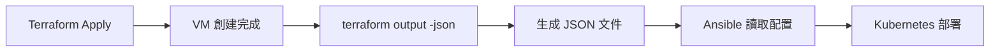

# Terraform Output 命令詳解

## **`terraform output -json > /tmp/terraform-output.json` 命令解析**

這條命令的作用是**將 Terraform 的所有輸出值以 JSON 格式保存到文件中**，供下游工具（如 Ansible、CI/CD 腳本）使用。

## **具體功能**

### **1. 收集所有 Output 值**
命令會收集 `outputs.tf` 中定義的所有輸出變數：

| 輸出名稱 | 內容類型 | 用途 |
|----------|----------|------|
| `cluster_summary` | 集群基本資訊 | 節點數量、版本等 |
| `master_nodes_details` | Master 節點詳情 | IP、CPU、記憶體等 |
| `worker_nodes_details` | Worker 節點詳情 | 同上 |
| `network_config` | 網路配置 | VIP、CIDR 等 |
| `ansible_inventory_path` | Ansible 庫存路徑 | 自動生成 |
| `ansible_command` | Ansible 執行命令 | 部署指令 |
| `ssh_connections` | SSH 連接資訊 | 所有節點的 SSH 指令 |
| `hosts_fragment` | /etc/hosts 內容 | DNS 解析配置 |
| `kubeadm_init_command` | K8s 初始化命令 | 集群安裝指令 |
| `verification_commands` | 驗證腳本 | 部署檢查命令 |

### **2. JSON 格式輸出**
```json
{
  "cluster_summary": {
    "value": {
      "master_count": 3,
      "worker_count": 1,
      "total_nodes": 4,
      "kubernetes_version": "1.32.0"
    }
  },
  "master_nodes_details": {
    "value": {
      "master-1": {
        "vm_id": 111,
        "ip": "192.168.0.11",
        "hostname": "master-1.detectviz.internal",
        "cores": 4,
        "memory": "8 GB"
      }
    }
  }
  // ... 其他輸出
}
```

### **3. 檔案保存**
- **位置**: `/tmp/terraform-output.json`
- **格式**: 結構化 JSON
- **用途**: 供其他工具解析使用

## **實際應用場景**

### **1. Ansible 自動化**
```bash
# 在 Ansible 中讀取 Terraform 輸出
- name: 讀取 Terraform 輸出
  command: cat /tmp/terraform-output.json
  register: tf_output

- name: 解析 JSON 並使用
  set_fact:
    master_ips: "{{ (tf_output.stdout | from_json).master_nodes_details.value | dict2items | map(attribute='value.ip') | list }}"
```

### **2. CI/CD 整合**
```bash
# 在 GitHub Actions 或 Jenkins 中
terraform output -json > terraform-output.json
# 然後其他 job 可以讀取這個文件
```

### **3. 腳本自動化**
```bash
# Bash 腳本中解析
MASTER_IPS=$(jq -r '.master_nodes_details.value | to_entries[] | .value.ip' /tmp/terraform-output.json)

for ip in $MASTER_IPS; do
  echo "配置節點: $ip"
  # 執行配置命令
done
```

## **工作流程**



## **DetectViz 項目中的作用**

在 DetectViz 項目中，這個命令：

1. ✅ **生成結構化配置**：將所有 VM 資訊整理為標準格式
2. ✅ **支持自動化**：Ansible 可以自動讀取 IP、hostname 等資訊
3. ✅ **確保一致性**：避免手動維護 IP 列表的錯誤
4. ✅ **版本控制友好**：JSON 格式易於解析和處理

## **替代方案**

如果不需要 JSON 格式，可以使用：
```bash
# 人類可讀格式
terraform output

# 特定輸出值
terraform output master_nodes_details

# 保存到變數
MASTER_IP=$(terraform output -raw master_nodes_details)
```

總之，`terraform output -json > /tmp/terraform-output.json` 是將 Terraform 的結構化輸出保存為標準 JSON 格式，供下游自動化工具使用的關鍵步驟！