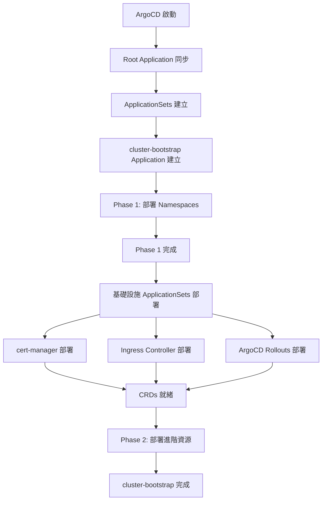

# Bootstrap 分階段部署說明

## 概述

Bootstrap 資源現在分為兩個階段部署,解決了 CRD 依賴問題:

```
argocd/bootstrap/
├── argocd-projects.yaml        # ArgoCD 專案配置
├── kustomization.yaml          # 主 kustomization
├── phase1-base/                # Phase 1: 基礎資源
│   ├── namespaces.yaml
│   └── kustomization.yaml
└── phase2-advanced/            # Phase 2: 進階資源
    ├── argocd-ingress.yaml
    ├── cluster-issuer.yaml
    ├── rollouts-extension.yaml
    └── kustomization.yaml
```

---

## 部署階段

### Phase 1: 基礎資源 (Sync Wave: -10)

**部署時機**: 立即部署
**依賴**: 無

**包含資源**:
- ✅ Namespaces (cert-manager, ingress-nginx, argo-rollouts, etc.)

**特性**:
- 不依賴任何 CRDs
- 最先部署 (Sync Wave: -10)
- 總是成功

### Phase 2: 進階資源 (Sync Wave: 10)

**部署時機**: 基礎設施部署完成後
**依賴**: cert-manager, Ingress Controller, ArgoCD Rollouts

**包含資源**:
- ⏳ ArgoCD Ingress (需要 Ingress Controller)
- ⏳ ClusterIssuer (需要 cert-manager)
- ⏳ ArgoCDExtension (需要 ArgoCD Rollouts)

**特性**:
- 依賴基礎設施 CRDs
- 稍後部署 (Sync Wave: 10)
- 使用 `SkipDryRunOnMissingResource=true` 避免預檢查失敗

---

## 部署流程

### 自動部署流程



### Sync Wave 順序

```
-10: Phase 1 (Namespaces)
  0: 基礎設施 ApplicationSets (cert-manager, ingress-nginx, etc.)
 10: Phase 2 (Ingress, Certificate, ClusterIssuer, Extensions)
```

---

## 驗證步驟

### 1. 檢查 Phase 1 部署

```bash
# 檢查 cluster-bootstrap 狀態
kubectl get application cluster-bootstrap -n argocd

# 檢查 namespaces 是否建立
kubectl get namespaces | grep -E "cert-manager|ingress-nginx|argo-rollouts"

# 預期輸出:
# cert-manager     Active   1m
# ingress-nginx    Active   1m
# argo-rollouts    Active   1m
```

### 2. 等待基礎設施部署

```bash
# 檢查基礎設施 Applications
kubectl get applications -n argocd | grep -E "cert-manager|ingress|rollouts"

# 等待 Pods 就緒
kubectl get pods -n cert-manager
kubectl get pods -n ingress-nginx
kubectl get pods -n argo-rollouts

# 檢查 CRDs
kubectl get crd | grep -E "cert-manager|ingress|rollouts"
```

### 3. 驗證 Phase 2 部署

```bash
# Phase 2 資源應該在基礎設施就緒後自動部署

# 檢查 ClusterIssuer
kubectl get clusterissuer

# 檢查 Certificate
kubectl get certificate -n argocd

# 檢查 Ingress
kubectl get ingress -n argocd

# 檢查 ArgoCD Extension
kubectl get argocextension -n default
```

---

## 故障排除

### 問題 1: Phase 2 資源仍然失敗

**症狀**: Phase 2 資源顯示 "OutOfSync" 或 "SyncFailed"

**原因**: 基礎設施 CRDs 尚未安裝

**解決方案**:
```bash
# 1. 確認基礎設施 Pods 運行
kubectl get pods -n cert-manager
kubectl get pods -n ingress-nginx

# 2. 確認 CRDs 存在
kubectl get crd certificates.cert-manager.io
kubectl get crd clusterissuers.cert-manager.io
kubectl get crd ingresses.networking.k8s.io

# 3. 手動觸發 cluster-bootstrap 同步
kubectl patch application cluster-bootstrap -n argocd \
  -p='{"metadata":{"annotations":{"argocd.argoproj.io/refresh":"hard"}}}' \
  --type=merge

# 4. 或使用 ArgoCD CLI
argocd app sync cluster-bootstrap --force
```

### 問題 2: SkipDryRunOnMissingResource 不生效

**症狀**: Phase 2 資源仍然在預檢查階段失敗

**解決方案**:
```bash
# 檢查 annotation 是否正確設定
kubectl get application cluster-bootstrap -n argocd -o yaml | grep sync-options

# 如果缺少,手動添加
kubectl patch application cluster-bootstrap -n argocd \
  -p='{"metadata":{"annotations":{"argocd.argoproj.io/sync-options":"SkipDryRunOnMissingResource=true"}}}' \
  --type=merge
```

### 問題 3: Phase 1 資源未部署

**症狀**: Namespaces 未建立

**解決方案**:
```bash
# 檢查 kustomize build
cd argocd/bootstrap
kustomize build phase1-base/

# 手動應用
kubectl apply -k phase1-base/

# 檢查 ArgoCD 日誌
kubectl logs -n argocd -l app.kubernetes.io/name=argocd-application-controller --tail=50
```

---

## 手動操作 (如果需要)

### 僅部署 Phase 1

```bash
cd argocd/bootstrap
kubectl apply -k phase1-base/
```

### 僅部署 Phase 2 (基礎設施就緒後)

```bash
cd argocd/bootstrap
kubectl apply -k phase2-advanced/
```

### 完整部署

```bash
cd argocd/bootstrap
kubectl apply -k .
```

---

## 新增資源指南

### 添加到 Phase 1 (基礎資源)

適用於:
- Namespaces
- RBAC (ClusterRole, ClusterRoleBinding)
- ConfigMaps/Secrets (不依賴 CRDs)
- ServiceAccounts

**步驟**:
```bash
# 1. 建立 YAML 檔案
vim argocd/bootstrap/phase1-base/new-resource.yaml

# 2. 添加到 kustomization.yaml
vim argocd/bootstrap/phase1-base/kustomization.yaml
# 在 resources: 下添加
#   - new-resource.yaml

# 3. Commit 並 push
git add argocd/bootstrap/phase1-base/
git commit -m "Add new-resource to Phase 1"
git push
```

### 添加到 Phase 2 (進階資源)

適用於:
- Certificates (cert-manager)
- Ingresses (Ingress Controller)
- Custom Resources (任何需要 CRDs 的資源)

**步驟**:
```bash
# 1. 建立 YAML 檔案
vim argocd/bootstrap/phase2-advanced/new-resource.yaml

# 2. 添加到 kustomization.yaml
vim argocd/bootstrap/phase2-advanced/kustomization.yaml
# 在 resources: 下添加
#   - new-resource.yaml

# 3. Commit 並 push
git add argocd/bootstrap/phase2-advanced/
git commit -m "Add new-resource to Phase 2"
git push
```

---

## Sync Wave 調整

如果需要更細緻的部署順序控制,可以調整 Sync Wave:

| Sync Wave | 用途 | 範例 |
|-----------|------|------|
| -20 | 最優先資源 | CRDs (如果手動管理) |
| -10 | Phase 1 基礎資源 | Namespaces, RBAC |
| 0 | 預設 | 大部分資源 |
| 10 | Phase 2 進階資源 | Certificates, Ingresses |
| 20 | 應用程式資源 | Deployments, Services |

**修改方法**:
```yaml
# 在 kustomization.yaml 中調整
commonAnnotations:
  argocd.argoproj.io/sync-wave: "-5"  # 調整為 -5
```

---

## 相關文件

- **argocd/bootstrap/README.md** - Bootstrap 資源概述
- **ansible/ARGOCD_ACCESS_AND_STATUS.md** - ArgoCD 訪問和狀態
- **ansible/DEPLOYMENT_COMPLETE_FINAL.md** - 完整部署報告

---

## 總結

✅ **優點**:
- 解決 CRD 依賴問題
- 清晰的部署階段
- 自動化程度高
- 易於維護和擴展

✅ **部署順序**:
1. Phase 1 立即部署 (Namespaces)
2. 基礎設施 ApplicationSets 部署組件
3. Phase 2 自動部署 (進階資源)

✅ **容錯機制**:
- SkipDryRunOnMissingResource 避免預檢查失敗
- Sync Wave 確保正確順序
- 即使 Phase 2 失敗,Phase 1 仍然成功

---

**文檔更新**: 2025-11-14
**版本**: 1.0
**狀態**: ✅ 已實施
