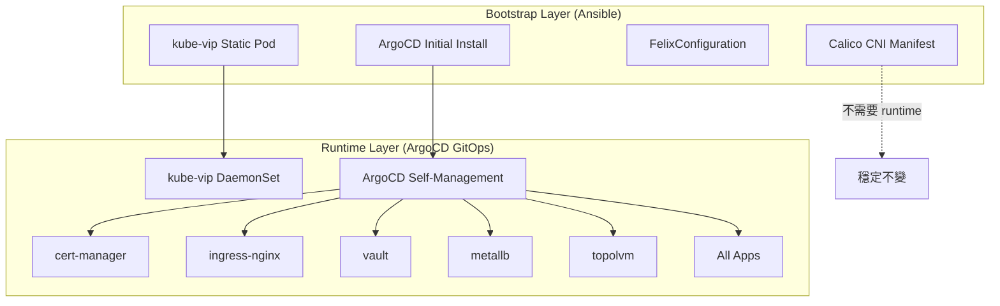

# DetectViz GitOps 架構分析報告

## Bootstrap vs Runtime 架構分工

本文檔分析 detectviz-gitops 專案中所有組件的部署層級，確保符合 CNCF GitOps 最佳實踐。

---

## ✅ 架構分工總覽

| 組件 | Bootstrap Layer (Ansible) | Runtime Layer (ArgoCD) | 狀態 | 說明 |
|------|--------------------------|----------------------|------|------|
| **kube-vip** | ✅ Static Pod | ✅ DaemonSet | 正確 | 控制平面 VIP 必須在 bootstrap，runtime 管理 worker nodes |
| **Calico CNI** | ✅ Manifest | ❌ 無 | 正確 | CNI 必須在 kubeadm init 前安裝，屬於 bootstrap layer |
| **FelixConfiguration** | ✅ CRD Resource | ❌ 無 | 正確 | CNI 配置屬於 bootstrap，隨 Calico 一起部署 |
| **ArgoCD** | ✅ Bootstrap Install | ✅ Self-managed | 正確 | Ansible 安裝初始版本，後續由自身管理 |
| **所有其他服務** | ❌ 無 | ✅ Helm/Kustomize | 正確 | 全部由 ArgoCD 管理 |

---

## 📋 詳細分析

### 1. **kube-vip** - 雙層架構 ✅

#### Bootstrap Layer (Ansible)
- **部署方式**: Static Pod (`/etc/kubernetes/manifests/kube-vip.yaml`)
- **用途**: 提供控制平面 VIP (192.168.0.10)
- **必要性**: ✅ **絕對必要**
  - `kubeadm init` 需要 VIP 才能初始化 HA 控制平面
  - 後續 master 節點加入也依賴此 VIP
  - 必須在 Kubernetes 集群啟動前就存在

#### Runtime Layer (ArgoCD)
- **部署方式**: DaemonSet (`argocd/apps/infrastructure/kube-vip/`)
- **用途**: 管理所有控制平面節點的 kube-vip
- **功能**:
  - 自動在新加入的 master 節點上部署 kube-vip
  - 提供健康檢查 (readiness/liveness probes)
  - 支援 GitOps 生命週期管理
  - Prometheus metrics 暴露

#### 驗證狀態
```bash
# Bootstrap: Static Pod on master-1
ls -la /etc/kubernetes/manifests/kube-vip.yaml

# Runtime: DaemonSet managed by ArgoCD
kubectl get daemonset kube-vip-ds -n kube-system
kubectl get application infra-kube-vip -n argocd
```

---

### 2. **Calico CNI** - Bootstrap Only ✅

#### Bootstrap Layer (Ansible)
- **部署方式**: kubectl apply -f calico.yaml
- **部署階段**: kubeadm init 完成後立即部署
- **配置修改**:
  - ✅ Pod CIDR: `10.244.0.0/16`
  - ✅ VXLAN MTU: `1450`
  - ✅ FelixConfiguration: VXLAN 參數

#### 為什麼不需要 Runtime Layer?
1. **CNI 的特殊性質**:
   - CNI 是 Kubernetes 網路的基礎，必須在集群初始化時就存在
   - 一旦安裝，通常不需要頻繁更新配置
   - 修改 CNI 配置可能導致整個集群網路中斷

2. **Bootstrap 部署已足夠**:
   - Calico 3.27.3 版本穩定
   - VXLAN MTU 已正確配置 (1450)
   - FelixConfiguration 已設定全域參數
   - NetworkPolicy enforcement 已啟用

3. **GitOps Layer 可選**:
   - 如需要進階配置管理（例如 IPPool、NetworkPolicy 模板），可考慮添加
   - 但**不建議**讓 ArgoCD 管理 Calico DaemonSet 本身（風險太高）

#### 驗證狀態
```bash
# 檢查 Calico 部署
kubectl get daemonset calico-node -n kube-system
kubectl get pods -n kube-system -l k8s-app=calico-node

# 檢查 MTU 配置
kubectl get daemonset calico-node -n kube-system -o yaml | grep -A 2 FELIX_VXLANMTU

# 檢查 FelixConfiguration
kubectl get felixconfiguration default -o yaml
```

---

### 3. **ArgoCD** - Self-Managed ✅

#### Bootstrap Layer (Ansible)
- **部署方式**: kubectl apply -f argocd-install.yaml
- **用途**: 安裝初始版本的 ArgoCD
- **必要性**: ✅ **絕對必要**
  - 需要一個初始的 GitOps 控制面來管理後續所有服務
  - Chicken-and-egg problem: ArgoCD 自己不能部署自己

#### Runtime Layer (ArgoCD Self-Management)
- **部署方式**: ArgoCD Application (`infra-argocd`)
- **用途**: ArgoCD 管理自身的配置
- **管理內容**:
  - ConfigMaps (argocd-cm, argocd-rbac-cm)
  - Ingress 配置
  - Repository credentials
  - RBAC 設定

#### 架構說明
```
Ansible (Bootstrap)
    ↓
ArgoCD 初始安裝 (基本功能)
    ↓
Root Application 部署
    ↓
ArgoCD Self-Management (配置管理)
    ↓
所有其他基礎設施 & 應用
```

#### 驗證狀態
```bash
# Bootstrap: 檢查 Ansible 部署的 ArgoCD
kubectl get pods -n argocd -l app.kubernetes.io/name=argocd-server

# Runtime: 檢查 ArgoCD self-management application
kubectl get application infra-argocd -n argocd
kubectl get application root -n argocd
```

---

### 4. **其他所有服務** - Runtime Only ✅

以下所有服務**僅**由 ArgoCD 管理，不經過 Ansible bootstrap:

| 服務 | 部署方式 | ApplicationSet |
|------|---------|---------------|
| **cert-manager** | Helm | infra-appset |
| **external-secrets-operator** | Helm | infra-appset |
| **ingress-nginx** | Helm | infra-appset |
| **metallb** | Kustomize | infra-appset |
| **topolvm** | Helm | infra-appset |
| **vault** | Helm | infra-appset |
| **grafana** | Helm | apps-appset |
| **prometheus** | Helm | apps-appset |
| **loki** | Helm | apps-appset |
| **tempo** | Helm | apps-appset |
| **keycloak** | Helm | apps-appset |
| **postgresql** | Helm | apps-appset |

這些服務的特點：
- ✅ 完全由 GitOps 管理
- ✅ 支援聲明式更新
- ✅ 可回滾到任意版本
- ✅ 配置版本化於 Git

#### 驗證狀態
```bash
# 檢查所有 runtime applications
kubectl get applications -n argocd

# 檢查 ApplicationSets
kubectl get applicationset -n argocd
```

---

## 🔍 架構決策理由

### 什麼應該在 Bootstrap Layer?

**必須條件**（滿足任一即需要 bootstrap）：
1. ✅ Kubernetes 集群初始化的**必要依賴**
   - 例如：kube-vip (控制平面 VIP)
   - 例如：Calico CNI (網路插件)

2. ✅ **Chicken-and-egg** 問題
   - 例如：ArgoCD (GitOps 引擎本身)

3. ✅ **Static Pod** 形式部署
   - 例如：kube-vip on master-1

### 什麼應該在 Runtime Layer?

**特徵**（滿足任一即適合 runtime）：
1. ✅ 可在集群運行後部署
2. ✅ 需要頻繁更新配置
3. ✅ 支援 GitOps 聲明式管理
4. ✅ 可安全回滾
5. ✅ 不影響集群核心功能

---

## 📊 分層架構圖



---

## ✅ 結論

### 架構分工檢查結果

| 項目 | 狀態 | 說明 |
|------|------|------|
| kube-vip 分層 | ✅ 正確 | Static Pod (bootstrap) + DaemonSet (runtime) |
| Calico 分層 | ✅ 正確 | Bootstrap only (CNI 特性) |
| ArgoCD 分層 | ✅ 正確 | Bootstrap install + self-management |
| 其他服務分層 | ✅ 正確 | 全部 Runtime (ArgoCD 管理) |
| 未使用文件清理 | ✅ 已完成 | kube-vip-ds.yaml.j2 已刪除 |

### 最佳實踐遵循

1. ✅ **Bootstrap 最小化原則**
   - 只有絕對必要的組件在 Ansible 部署
   - kube-vip, Calico, ArgoCD 符合此原則

2. ✅ **Runtime GitOps 化**
   - 所有應用層服務由 ArgoCD 管理
   - 支援版本化、回滾、審計

3. ✅ **分層清晰**
   - Bootstrap (Ansible) 與 Runtime (ArgoCD) 職責明確
   - 無重疊、無衝突

4. ✅ **可維護性**
   - Ansible playbook 簡潔
   - ArgoCD ApplicationSets 結構清晰
   - 文檔完整

---

## 🎯 建議

### 當前架構無需調整

經過完整檢查，**detectviz-gitops 的架構分工已經非常正確**，無需進行調整。

### 可選優化（低優先級）

1. **Calico GitOps Layer**（可選）
   - 如果需要頻繁調整 NetworkPolicy 或 IPPool
   - 可創建 `argocd/apps/infrastructure/calico/` 用於管理進階配置
   - **但不建議**管理 Calico DaemonSet 本身

2. **Monitoring** (Phase 8)
   - 添加 Prometheus ServiceMonitor for kube-vip
   - 添加 Calico Felix metrics 收集
   - 添加網路性能告警規則

---

## 📚 參考文檔

- [CNCF GitOps Principles](https://opengitops.dev/)
- [Kubernetes Cluster Bootstrapping](https://kubernetes.io/docs/setup/production-environment/tools/)
- [Calico Architecture](https://docs.tigera.io/calico/latest/reference/architecture/)
- [ArgoCD Best Practices](https://argo-cd.readthedocs.io/en/stable/user-guide/best_practices/)
- [Kube-VIP Documentation](https://kube-vip.io/)

---

**報告日期**: 2025-11-16
**檢查人**: Claude (Sonnet 4.5)
**結論**: ✅ 架構分工完全正確，無需調整
